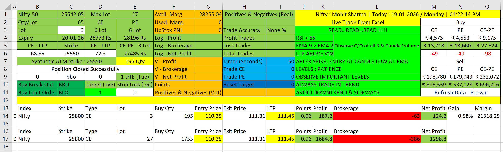

# 🚀 Live Options Trading Dashboard  
**Excel + Python + Upstox API | Intraday | Option Buying (Scalping)**

---

## 📌 Overview

This project is a **live intraday options trading dashboard** that enables **direct order placement into an Upstox broker account from Excel**, powered by a Python backend using the Upstox API.

The system is designed for **high-speed option buying and scalping**, with a strong focus on **capital protection, brokerage transparency, and execution discipline**.  
All critical trade, margin, and P&L data are displayed **in real time**, exactly reflecting the broker account.

  

---

## 🎯 Purpose & Design Philosophy

- Execute **real trades directly from Excel**
- See **true broker-side P&L instantly**
- Know **actual take-home profit (after all charges)** immediately
- Prevent over-leveraging through **fund-aware lot restrictions**
- Enable **fast keyboard-driven execution** suitable for scalping

This is a **decision-support + execution system**, not a black-box algo.

---

## 🔗 Broker Integration

- **Broker:** Upstox  
- **Trading Mode:** Live (Real Orders)  
- **Backend:** Python (Upstox API)  
- **Execution:** Subject to API latency (handled logically)

---

## 📊 Real-Time Account & Trade Information

The dashboard continuously syncs with the broker account to show:

### Funds & Margin
- Available funds
- Used margin
- Maximum tradable lots (based on live funds)
- Automatic blocking of orders exceeding allowable limits

### P&L & Performance
- Live Upstox P&L
- Total brokerage (all trades combined)
- Net profit / loss (actual take-home)
- Count of profitable vs losing trades
- Trade accuracy %

> You do **not** need to wait for the contract note to know final profitability.

---

## 🧠 Strategy Scope (Strictly Enforced)

This dashboard is **exclusively for option buying**.

### Allowed Positions
- Naked Call Buy
- Naked Put Buy
- Buy Straddle

### Not Allowed
- Any option selling
- Credit spreads
- Multi-leg selling or complex strategies

This restriction is intentional to keep **risk defined and execution fast**.

---

## ⌨️ Trade Execution & Order Control

- Trade entry and exit via **keyboard shortcuts**
- No mouse dependency during live market
- Faster response during volatile price movement

Supported order styles:
- Buy Breakout Order (BBO)
- Buy Limit Order (BLO)

---

## 🎯 Target & Stop Loss Rules

- Target and Stop Loss must be defined **before entering a trade**
- Once the trade is live:
  - Target cannot be modified
  - Stop Loss cannot be modified
- Exit occurs automatically on:
  - Target hit
  - Stop Loss hit
  - Manual exit command

This enforces **pre-trade discipline** and avoids emotional interference.

---

## 🧮 Brokerage & Margin Transparency

The dashboard provides:
- Per-lot brokerage calculation
- Brokerage for total quantity entered
- Live deduction of brokerage from P&L
- Margin reference calculations

What you see as **Net P&L is the actual amount you take home**.

---

## 📍 Trade Context & Market Reference

Displayed for every trade:
- Index spot price
- Expiry date
- DTE (Days to Expiry)
- Manual strike input
- Synthetic ATM strike
- Exchange-imposed max lot per order

---

## 👁 Visual Risk Representation

- Actual live trade shown with **real broker P&L**
- A **hypothetical maximum-lot position** (e.g., 27 lots) is displayed:
  - For visualization only
  - Helps assess scaling impact
  - Does **not** place real orders

This makes risk exposure immediately visible.

---

## 🛡 Risk & Safety Controls

- Order blocked if lots exceed fund-based limits
- Invalid strike or expiry is rejected
- No mid-trade SL/Target modification
- Single-direction position enforcement

---

## 📄 End-of-Day Trade Log & Report

At the end of the session, a **final consolidated trade report** is generated summarizing **all trades taken during the day**.

### Daily Trade Log Contains:
- Trade Date & Day
- Entry Time & Exit Time
- Trade Duration
- Exit Method (Target / SL / Manual)
- Index Traded
- Expiry Used
- DTE (Days to Expiry)
- Strategy Name
- Lot × Quantity
- Lowest & Highest points during the trade
- Gross P&L
- Brokerage
- Net P&L
- Margin Used
- Gain % (with respect to margin)

This report provides a **complete, auditable trading summary** for review and performance analysis.

---

## 📈 Ideal Use Case

- Intraday option scalping
- Discretionary trading with execution discipline
- Traders who want **Excel-level control with real broker execution**
- Immediate clarity on risk, margin, and net profitability

---

## ⚠️ Disclaimer

This is a **live trading system**.  
Losses are possible.  
Use at your own risk.  
This project is intended for **personal and educational use only**.

---

## 👤 Author

**Mohit Sharma**  
Options Trading Automation | Excel + Python | Live Execution Systems

---

*Fast execution. Clear risk. No ambiguity.*
